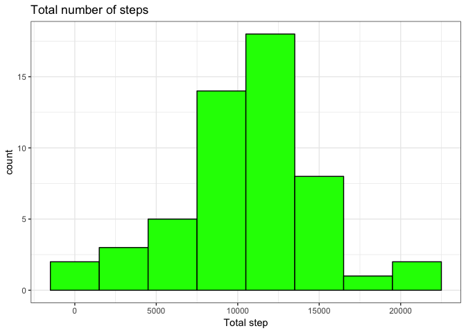
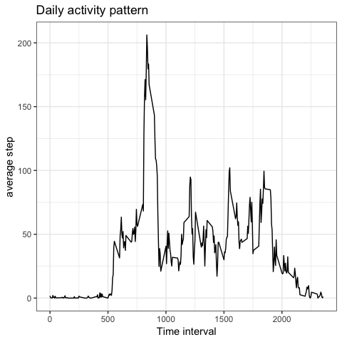
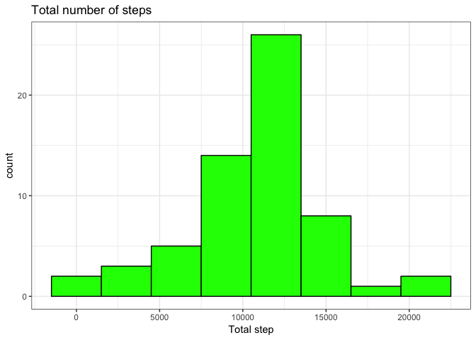
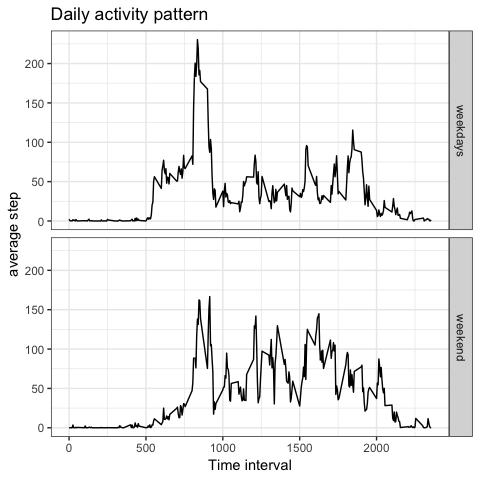

## Loading and preprocessing the data

```r
library(dplyr)
```

```
## 
## Attaching package: 'dplyr'
```

```
## The following objects are masked from 'package:stats':
## 
##     filter, lag
```

```
## The following objects are masked from 'package:base':
## 
##     intersect, setdiff, setequal, union
```

```r
library(ggplot2)

#Read and formatting data
unzip("activity.zip",exdir = "data")
data_set <- read.csv("data/activity.csv", stringsAsFactors=FALSE)
data_set$date <- as.Date( data_set$date, format = "%Y-%m-%d")
```


## What is mean total number of steps taken per day?


```r
#What is mean total number of steps taken per day?
aggregate(data_set$steps,by = list(data_set$date), FUN= sum)%>% na.omit() %>%
ggplot( aes(x= x)) + geom_histogram(binwidth = 3000, fill = "green", col = "black")+theme_bw()+ labs(title = "Total number of steps", x = "Total step") 
```

<!-- -->

```r
print(c("Mean:" ,as.integer(mean(aggregate(data_set$steps,by = list(data_set$date), FUN= sum)$x, na.rm = TRUE))))
```

```
## [1] "Mean:" "10766"
```

```r
print(c("Median:" ,as.integer(median(aggregate(data_set$steps,by = list(data_set$date), FUN= sum)$x, na.rm = TRUE))))
```

```
## [1] "Median:" "10765"
```

## What is the average daily activity pattern?

```r
#What is the average daily activity pattern?

group_by(data_set, interval)%>% summarise_at(vars(steps), funs(mean(., na.rm = TRUE)))%>%
ggplot()+ geom_line(aes (x= interval, y= steps))+ theme_bw() +labs(title = "Daily activity pattern", x = "Time interval", y= "average step") 
```

```
## Warning: funs() is soft deprecated as of dplyr 0.8.0
## please use list() instead
## 
## # Before:
## funs(name = f(.)
## 
## # After: 
## list(name = ~f(.))
## This warning is displayed once per session.
```

<!-- -->

```r
group_by(data_set, interval)%>% summarise_at(vars(steps), funs(mean(., na.rm = TRUE)))-> q2
print (c("Maximum number of steps at ", q2[q2$steps == max(q2[,2]), 1]))
```

```
## [[1]]
## [1] "Maximum number of steps at "
## 
## $interval
## [1] 835
```


## Imputing missing values

```r
print(c("total number of rows with NA", sum(is.na(data_set$steps))))
```

```
## [1] "total number of rows with NA" "2304"
```

```r
left_join(q2, data_set[ is.na(data_set$steps), c(2,3)], by = "interval" ) -> sub
data_set-> new_data_set
cbind(sub[,2:3], sub[,1]) -> new_data_set[ is.na(new_data_set$steps),]

aggregate(new_data_set$steps,by = list(new_data_set$date), FUN= sum) -> stepsum
ggplot(stepsum, aes(x= stepsum$x)) + geom_histogram(binwidth = 3000, fill = "green", col = "black")+theme_bw()+ labs(title = "Total number of steps", x = "Total step") 
```

<!-- -->


```r
print(c("Mean:" ,as.integer(mean(stepsum$x, na.rm = TRUE))))
```

```
## [1] "Mean:" "10766"
```

```r
print(c("Median:" ,as.integer(median(stepsum$x, na.rm = TRUE))))
```

```
## [1] "Median:" "10766"
```


## Are there differences in activity patterns between weekdays and weekends?


```r
#Are there differences in activity patterns between weekdays and weekends?
new_data_set$DateCat<- ifelse(weekdays(new_data_set$date) %in% c("Saturday","Sunday"), "weekend", "weekdays")

group_by(new_data_set, DateCat, interval)%>% summarise_at(vars(steps), funs(mean(., na.rm = TRUE)))%>%
ggplot()+ geom_line(aes (x= interval, y= steps))+ theme_bw() +labs(title = "Daily activity pattern", x = "Time interval", y= "average step") + facet_grid(DateCat ~.)
```

<!-- -->
